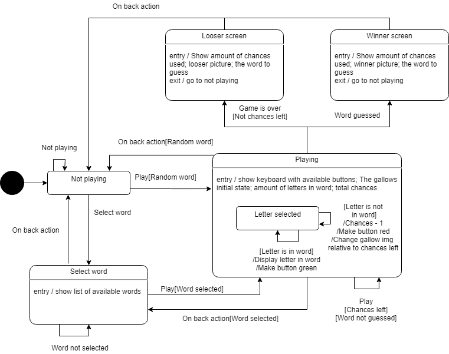

# Mark Rune Mortensen - s174881 Galgeleg

## Tilstandsmaskine


## Relevante patterns

I den afleverede kode er der brugt følgende patterns:
* Factory pattern
   ```Java
  Executor bgThread = Executors.newSingleThreadExecutor();
  ```
* Observer pattern
  ```Java
  new View.OnClickListener();
  ```
Factory pattern bruges til at oprette en ny thread til at køre baggrundsopgaver.
Observer pattern bruges til at lytte på om en knap bliver trykket på.

## Kommunikation mellem logik og UI via patterns

I denne opgave er observers brugt til en stor del af logiken til styirng af UI. Logikken begynder først når brugeren trykker på en knap og når logikken skal opdatere UI, vil den kalde på UI tråden.

## SOLID principper

I denne opgave er SOLID principperne fulgt så godt som muligt hvor det giver mening.
* Single-responsibility
  * En klasse skal kun have et ansvar, OrdData henter f.eks. kun data, SpilActivity har kun noget med SpilActivity at gøre og SpilLogik har kun noget med SpilLogik at gøre.
* Open-closed principle
  * Open-closed princippet er brugt til at lave brugergrænsefladen. Klassen AppCompatActivity (Arver fra FragmentActivity og implementerer flere interfaces) bruges til alt med brugergrænsefladen.
* Liskov substitution principle
  * Programmet bryder ikke ISA relationer.
* 


## Links:

* https://en.wikipedia.org/wiki/SOLID
* https://docs.google.com/document/d/1d0u0hvXTExwkC6N2B93xA4gS5wVxA3DIVd8bYe2efyk/edit#
* https://app.diagrams.net/#G18-0J07KPwafXg03YD8tcGWg_-_m7k2d4