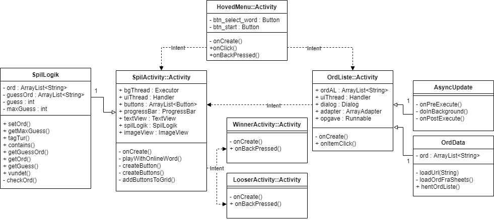

# Mark Rune Mortensen - s174881 Galgeleg

## Tilstandsmaskine


## Relevante patterns

I den afleverede kode er der brugt følgende patterns:
* Factory pattern
   ```Java
  Executor bgThread = Executors.newSingleThreadExecutor();
  ```
* Observer pattern
  ```Java
  new View.OnClickListener();
  ```
Factory pattern bruges til at oprette en ny thread til at køre baggrundsopgaver.
Observer pattern bruges til at lytte på om en knap bliver trykket på.

## Kommunikation mellem logik og UI via patterns

I denne opgave er observers brugt til en stor del af logiken til styirng af UI. Logikken begynder først når brugeren trykker på en knap og når logikken skal opdatere UI, vil den kalde på UI tråden.

## SOLID principper

I denne opgave er SOLID principperne fulgt så godt som muligt hvor det giver mening.
* Single-responsibility
  * En klasse skal kun have et ansvar, OrdData henter f.eks. kun data, SpilActivity har kun noget med SpilActivity at gøre og SpilLogik har kun noget med SpilLogik at gøre.
* Open-closed principle
  * Open-closed princippet er brugt til at lave brugergrænsefladen. Klassen AppCompatActivity (Arver fra FragmentActivity og implementerer flere interfaces) bruges til alt med brugergrænsefladen.
  * F.eks OrdListe implementerer AdapterView.OnItemClickListener, så man kan lytte på om der trykkes på en af ordne i listen.
* Liskov substitution principle
  * Ved at bruge extends AppCompatActivity, laves en onCreate() som gør at klassen kan bruges som UI på en android telefon. Alle apps med AppCompatActivity kan derfor skiftes mellem.
* Interface Segregation principle
  * Der ses igen på brugergrænsefladen og OrdListen, der er ikke unødvendige interfaces, og de interfaces som bruges forklarer sig selv og er generelt små.
* Dependency inversion principle
  * Hver activity skal bruge onClick for knapper i dette program, men de skal ikke alle gøre det samme. Der arves derfor fra View.OnClickListener, som gør at programmet tager brug af Dependency inversion princippet.


## UML


